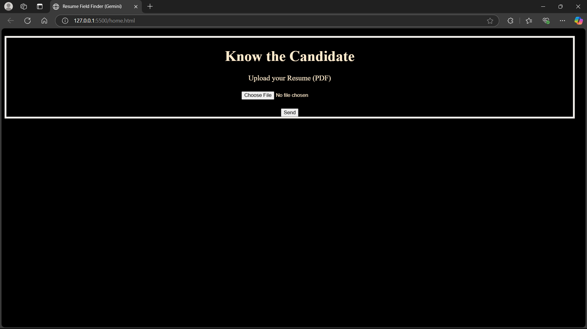
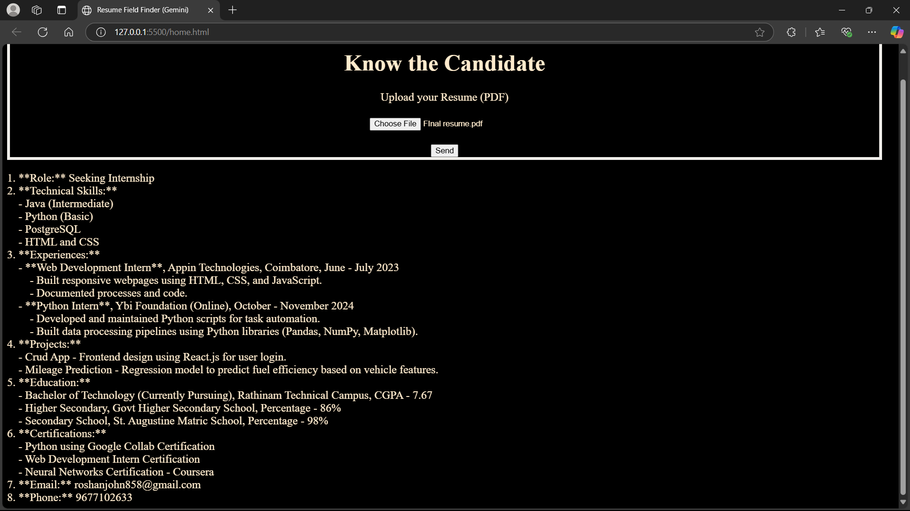

# CAPTURING RESUME IMPORTANT DATA

**Table of content:**
-
 - [About Project](#item-one)
 - [Get Started](#item-two)
    - [Instruction](#item-two-one)
 - [Usage](#item-three)
 - [Contact](#item-four)

 
 <!-- headings -->
 
 # About Project
This web based application is used to find the important fields in resume like
 - Role
 - Experience
 - Technical Skills
 - Mail ID
 - Phone number
 
 
 # Get Started
  This gives the ways and instructions that are required to run this website 
  
  
  ### Instruction

  Link the necessary libraries and API for this project. 
  -  pdfJs Library - allows you to render Portable Document Format (PDF) files in a web browser without the need for any plugins or external software

        -> Link for pdfJs Library [pdfJs](https://mozilla.github.io/pdf.js/)
- Gemini API -a set of tools and interfaces that allows developers to access and integrate Google's Gemini family of large language models (LLMs) into their applications

    ->Link for Gemini API key [Gemini API](https://ai.google.dev/api?lang=node) 

  
 
 # Usage

 Snipshoots of the project is being attached for reference
 -

 Image of the Website

 

Output 
-

# Contact

- E-Mail id: jpradeepavt@gmail.com
- Phone    : +91 7871053713

